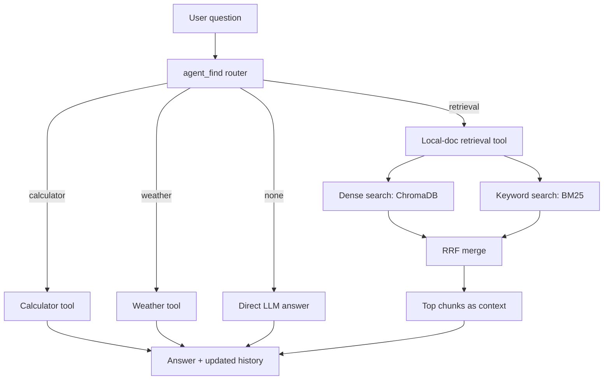

# Multi-Agent RAG Chat — India Wikipedia + Calculator + Weather

A tool-routing RAG (Retrieval-Augmented Generation) chatbot built with LangChain, ChromaDB, BM25, and Groq — wrapped in a Streamlit chat UI. It answers general-knowledge questions about India (and Virat Kohli) from a local Wikipedia knowledge base, does arithmetic, and reports live weather, automatically picking the right tool for each question.

**Live demo:** _add your Streamlit Cloud URL here, e.g. `https://your-app-name.streamlit.app`_

## Features

- **Hybrid retrieval** — combines dense vector search (ChromaDB + Sentence-Transformers embeddings) with keyword search (BM25), merged using Reciprocal Rank Fusion (RRF) for more relevant results than either method alone.
- **Multi-agent tool routing** — an LLM-based router decides, per question, whether to use the calculator, the weather tool, or the local-document retriever.
- **Calculator tool** — evaluates arithmetic expressions safely with `ast.literal_eval`.
- **Weather tool** — fetches live weather for any location via [wttr.in](https://wttr.in).
- **Local document retrieval** — scrapes and indexes a set of India-related Wikipedia pages, cleaned to keep only article content (navigation/sidebar text stripped out).
- **Conversation memory** — recent turns are replayed back to the LLM so follow-up questions ("add 5 to that") work correctly.
- **Streamlit chat interface** — runs directly on top of the existing Jupyter notebook (no duplicated pipeline code), with a sidebar showing conversation history.

## Tech stack

| Layer | Tool |
|---|---|
| LLM | Groq (`openai/gpt-oss-20b`) via `langchain-groq` |
| Vector store | ChromaDB (persistent, local) |
| Embeddings | `sentence-transformers` (`all-MiniLM-L6-v2`) |
| Keyword search | `rank_bm25` |
| Document loading | `langchain_community.WebBaseLoader` + BeautifulSoup |
| Orchestration | LangChain (tools, agents, messages) |
| UI | Streamlit |

## How it works



1. **Indexing (runs once, cached):** Wikipedia pages are loaded, cleaned to the main article body, split into overlapping chunks, de-duplicated by content hash, embedded, and stored in ChromaDB. A parallel BM25 keyword index is built from the same chunks.
2. **Routing:** each incoming question is classified by the LLM into one of: calculator, weather, retrieval, or "not related" (answered directly).
3. **Retrieval (if selected):** the query is rewritten for semantic search, run against both ChromaDB (dense) and BM25 (keyword), and the two result lists are merged with Reciprocal Rank Fusion to surface the most relevant chunks.
4. **Answer generation:** the selected tool's output (or the retrieved context) is used to produce the final answer, and the turn is appended to conversation history so follow-up questions have context.

## Project structure

```
.
├── code.ipynb          # Main notebook: indexing, tools, agents, router, search()
├── app.py              # Streamlit UI — runs code.ipynb's cells and calls search()
├── requirements.txt    # Python dependencies for local + cloud deployment
├── urls.txt            # (reference) list of source Wikipedia URLs
└── Multi_Agent-DB/     # ChromaDB persistent storage (auto-created, not required in repo)
```

## Running locally

1. Clone the repo and open it in your project folder.
2. Create a virtual environment and install dependencies:
   ```
   pip install -r requirements.txt
   ```
3. Create a `.env` file in the same folder with your Groq API key:
   ```
   GROQ_API_KEY=your-actual-key-here
   ```
4. Open `app.py` and set `NOTEBOOK_PATH` to your notebook's filename (e.g. `"code.ipynb"`).
5. Run the app:
   ```
   streamlit run app.py
   ```
   The first run takes a few minutes — it downloads the embedding model and builds the index from Wikipedia. Subsequent runs are cached.

## Deployment (Streamlit Community Cloud)

1. Push `app.py`, `code.ipynb`, and `requirements.txt` to a GitHub repo (do **not** commit `.env`).
2. Go to [share.streamlit.io](https://share.streamlit.io), sign in with GitHub, and click **New app**.
3. Select the repo, branch (`main`), and set **Main file path** to `app.py`.
4. Under **Advanced settings → Secrets**, add:
   ```toml
   GROQ_API_KEY = "your-actual-key-here"
   ```
5. Click **Deploy**. The app will install dependencies, run the notebook once, and give you a public `*.streamlit.app` URL.

## Known limitations

- ChromaDB's storage is not guaranteed to persist across Streamlit Cloud restarts — the index simply rebuilds from Wikipedia on the next cold start.
- The router uses plain string matching on the LLM's text response rather than structured/function-calling output, so it can occasionally misclassify ambiguous questions.
- Only the single Streamlit Cloud free-tier resource limits apply — very large knowledge bases may need a paid tier or a lighter embedding model.

## License

Add a license of your choice (e.g. MIT) here.
